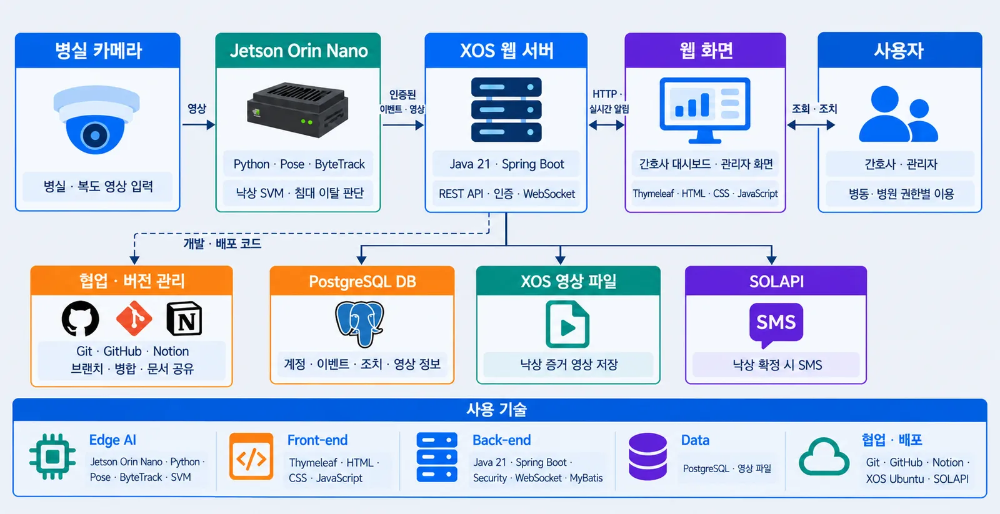
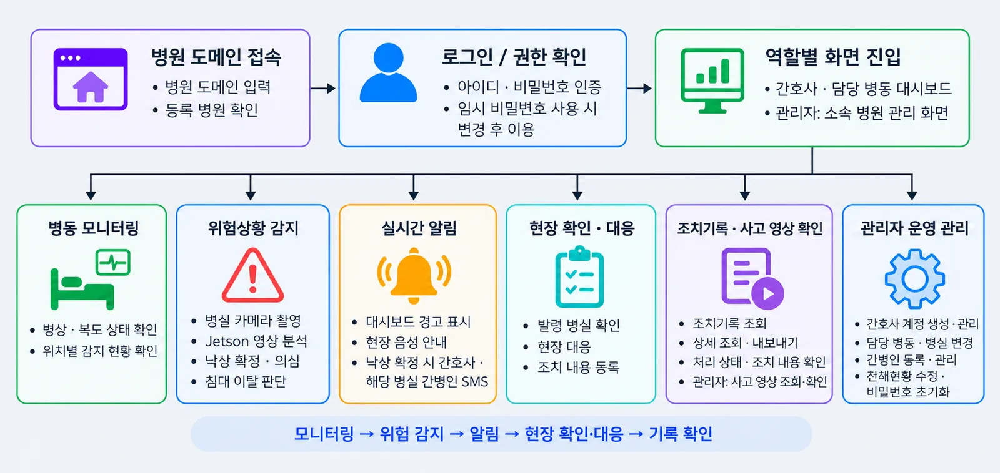
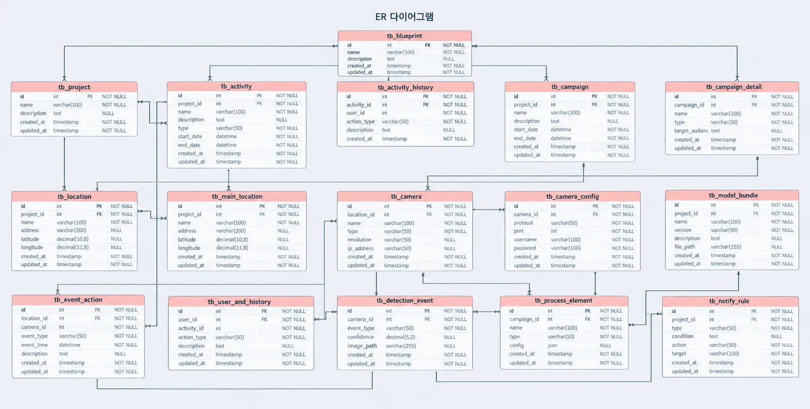

#  ALL EYES — 시각지능 기반 요양병원 위험상황 감지 서비스

## 1. 프로젝트명 / 팀명

**ALL EYES** — 시각지능 기반 요양병원 위험상황 감지 서비스

* **프로젝트 유형**: 기업 연계 실전 프로젝트
* **팀명**: AII IN ONE

<br>

## 2. 서비스 소개

* **서비스명**: 시각지능 기반 요양병원 위험상황 감지 서비스
* **서비스 설명**:
  * 요양병원에서는 낙상이나 침대 이탈이 발생해도 직원이 모든 병실을 계속 살피기 어렵습니다.
  * ALL EYES는 USB 웹캠과 Jetson Orin Nano에서 실시간 영상을 분석해 낙상·낙상 의심·침대 이탈을 감지합니다.
  * 감지한 이벤트를 서버에 저장하고 해당 병동 대시보드에 전달해, 직원이 위험 위치를 확인하고 현장에 대응할 수 있도록 돕습니다.
  * 확정 낙상 발생 시 담당 간호사와 병실 간병인에게 SMS를 발송합니다. 현장 확인 후에는 환자 이름과 조치 내용을 기록할 수 있습니다.
  * 관리자는 병원 전체의 위험상황, 직원·간병인 정보, 조치기록과 사고 영상을 한곳에서 확인할 수 있습니다.

<br>

## 3. 프로젝트 기간

**2026.09.02 ~ 2026.10.02**

<br>

## 4. 주요 기능

* Jetson Orin Nano와 USB 웹캠을 이용한 실시간 위험상황 감지
* YOLO11n-Pose·ByteTrack 기반 자세 정보와 사람 추적 정보 활용
* 낙상 / 낙상 의심 / 침대 이탈 유형별 알림 정책 적용
* Spring Boot와 WebSocket/STOMP를 활용한 병동별 실시간 대시보드
* 확정 낙상 발생 시 담당 간호사·간병인 대상 SMS 발송 및 발송 이력 관리
* 현장 확인과 이벤트별 조치기록 등록
* 낙상 증거영상 저장·조회 및 관리자 사고영상 보관함
* 병원·병동·병실 단위 직원·간병인 담당 관리
* 관리자 직접 직원 계정 발급, 활성·비활성 상태 관리
* 최초 로그인 시 비밀번호 변경 및 권한별 화면 접근 제어
* 병원 전체 현황과 병동별·시간대별 위험상황 통계 제공

<br>

## 5. 기술스택

<table>
  <tr>
    <th>구분</th>
    <th>내용</th>
  </tr>
  <tr>
    <td>언어</td>
    <td></td>
  </tr>
  <tr>
    <td>백엔드</td>
    <td>  </td>
  </tr>
  <tr>
    <td>데이터베이스</td>
    <td></td>
  </tr>
  <tr>
    <td>실시간 통신</td>
    <td></td>
  </tr>
  <tr>
    <td>하드웨어</td>
    <td>Jetson Orin Nano / USB 웹캠</td>
  </tr>
  <tr>
    <td>위험상황 감지</td>
    <td>YOLO11n-Pose / ByteTrack / SVM</td>
  </tr>
  <tr>
    <td>문자 알림</td>
    <td>SOLAPI</td>
  </tr>
</table>

<br>

## 6. 시스템 아키텍처



<br>

## 7. 유스케이스

<!-- 유스케이스 이미지를 추가해주세요. -->

<br>

## 8. 서비스 흐름도



<br>

## 9. ER 다이어그램



<br>

## 10. 화면 구성

### 병원 도메인 화면

병원 도메인을 조회하고 해당 병원으로 접속하는 화면입니다.

<!-- 병원 도메인 화면 이미지를 추가해주세요. -->

### 로그인화면

직원과 관리자가 로그인하는 화면입니다. 로그인한 사용자의 권한에 따라 접근할 수 있는 화면과 이동 경로를 구분했습니다.

<!-- 로그인 화면 이미지를 추가해주세요. -->

### 최초 로그인·비밀번호 변경

최초 로그인 시 비밀번호를 변경하도록 안내하고, 로그인 후에도 비밀번호를 변경할 수 있도록 구성했습니다.

<!-- 비밀번호 변경 화면 이미지를 추가해주세요. -->

### 병동별 대시보드

담당 병동에서 발생한 위험상황을 실시간으로 확인하는 화면입니다.

<!-- 병동별 대시보드 이미지를 추가해주세요. -->

### 낙상 대응 등록

직원이 현장을 확인한 뒤 환자 이름과 조치 내용을 기록하는 팝업입니다.

<!-- 낙상 대응 등록 팝업 이미지를 추가해주세요. -->

### 직원 계정 관리

관리자가 직원 계정을 발급하고 소속 병동과 계정 상태를 관리하는 화면입니다.

<!-- 직원 계정 관리 화면 이미지를 추가해주세요. -->

### 비활성 직원 목록

비활성 계정을 조회하고 재활성화하거나 삭제하는 화면입니다.

<!-- 비활성 직원 목록 화면 이미지를 추가해주세요. -->

### 사고영상 보관함·조치기록

위험상황에 연결된 사고 영상과 조치기록을 확인하는 화면입니다.

<!-- 사고영상 보관함과 조치기록 화면 이미지를 추가해주세요. -->

### 관리자 현황·통계

병원 전체 위험상황과 병동별·시간대별 통계를 확인하는 화면입니다.

<!-- 관리자 현황 및 통계 화면 이미지를 추가해주세요. -->

<br>

## 11. 시연 영상

<!-- 시연 영상 링크를 추가해주세요. -->

<br>

## 12. 팀원 역할

| 구정경 — 풀스택 |
|---|
| 병원 도메인 조회 및 병원별 접속 처리 |
| Spring Security 기반 로그인·로그아웃, 권한별 접근 및 이동 구현 |
| 직원 소속 병동 정보 연동, 활성 직원·병동 조회 및 담당 병동 변경 |
| 관리자 직접 직원 계정 발급, 비활성화·재활성화·삭제 기능 구현 |
| 최초 로그인 비밀번호 변경 강제, 비밀번호 변경·초기화 및 보안 처리 |
| 화면 접근 제어, 사용자 세션 정보·로그인 유지 및 캐시 방지 처리 |
| 도메인 화면, 관리자 화면, 비활성 직원 목록 화면 구현 |
| 병동별 대시보드와 낙상 대응 등록 팝업 작업 참여 |
| 화면에서 서버 기능을 사용할 수 있도록 API 연결 |

<!-- 다른 팀원의 이름과 담당 역할을 확인한 뒤 표에 추가해주세요. -->

<br>

## 13. 트러블슈팅

| 문제 | 원인 | 해결 |
|---|---|---|
| 직원 직접 회원가입과 관리자 계정 발급 방식이 함께 고려되면서 계정 운영 흐름이 복잡해졌습니다. 가입 승인과 비활성 계정 처리 기준도 명확하지 않았습니다. | 계정을 누가 생성할지, 계정 상태를 어떻게 구분할지 먼저 확정하지 않은 상태에서 회원가입·승인·계정 복구 기능을 설계했습니다. | 관리자가 직원 정보를 확인하고 계정을 직접 발급하는 방식으로 전환했습니다. 직접 발급 기능과 상태 정리를 구현하고, 승인 대기 상태인 `PENDING`을 제거했습니다. `APPROVED`는 활성 계정, `INACTIVE`는 비활성 계정으로 구분했습니다. |

**변경 후 계정 흐름**

```text
관리자 직원 정보 확인
→ 직원 계정 직접 발급
→ 최초 로그인 시 비밀번호 변경
→ 정상 사용
→ 휴직·퇴직 시 비활성화
→ 복직 시 재활성화
```

계정 발급 책임을 관리자로 정하고, 가입 승인 대기와 비활성화를 별도로 처리하던 흐름을 정리했습니다. 이번 작업을 통해 인증 기능을 만들기 전에 계정 생성 주체와 상태별 처리 기준부터 정해야 한다는 점을 배웠습니다.

<br>
